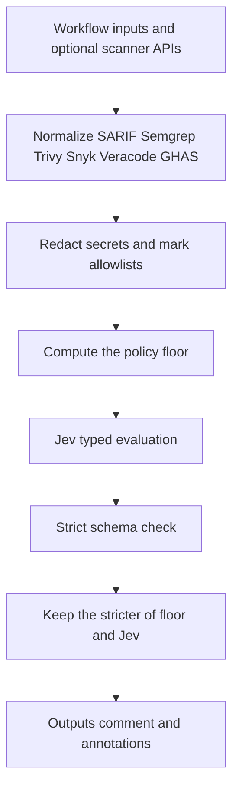

# JEV Security Sentinel

JEV Security Sentinel is a GitHub Action that turns SAST, SCA, IaC, secrets, and container findings into a gate decision: `PASS`, `WARN`, `BLOCK`, or `REVIEW`.

Jev proposes the decision. A deterministic policy then keeps every finding visible and can only make the result stricter. Allowlists change the gate effect of a finding. They do not delete it.

## How it works



Jev is called through one provider, selected by `jev_provider` or `.jev/config.yml`:

| Provider | Credential | Model |
| --- | --- | --- |
| `vercel-ai-gateway` (default) | `AI_GATEWAY_API_KEY` | `typesafe-ai/jev` via `experimental_evaluate` |
| `typesafe-native` | `TYPESAFE_API_KEY` | `jev_model` from the native catalog |
| `custom-compatible` | `JEV_CUSTOM_API_KEY` | `jev_model` at an HTTPS `jev_endpoint` |

The gateway adapter is isolated behind `JevProvider` and does not use `generateText`. Providers do not fall back to each other. If Jev is unavailable or the payload fails the schema, the result is provisional and the configured low-confidence policy applies. The Action does not invent a confident AI decision.

## Quick start

```yaml
name: Security gate
on:
  pull_request:
permissions:
  contents: read
  pull-requests: read
jobs:
  sentinel:
    runs-on: ubuntu-latest
    steps:
      - uses: actions/checkout@v4
      - uses: JevForge/jev-security-sentinel@v0.1.0
        with:
          sarif_path: reports/results.sarif
          environment: production
          gate_scope: changed
        env:
          AI_GATEWAY_API_KEY: ${{ secrets.AI_GATEWAY_API_KEY }}
```

Pin `@v0.1.0`, the floating major `@v0`, or a commit SHA.

## Inputs

Required data is at least one finding source, or an explicit remote fetch. If nothing is configured, the gate still runs and reports `NO_FINDINGS`.

| Input | Default | Role |
| --- | --- | --- |
| `findings`, `findings_path` | empty | Normalized JSON |
| `sarif_path` | empty | SARIF 2.1.0 |
| `semgrep_path` | empty | Semgrep CLI or API JSON |
| `trivy_path` | empty | Trivy JSON |
| `snyk_path` | empty | Snyk CLI or REST JSON |
| `veracode_path` | empty | Veracode findings JSON |
| `fetch_ghas` | `false` | Open code scanning, secret scanning, and Dependabot alerts |
| `fetch_snyk` | `false` | Snyk REST issues. Needs `SNYK_TOKEN` and `snyk_org_id` |
| `fetch_veracode` | `false` | Veracode findings API. Needs `VERACODE_API_ID`, `VERACODE_API_KEY`, `veracode_app_guid` |
| `fetch_semgrep` | `false` | Semgrep App findings. Needs `SEMGREP_APP_TOKEN` and `semgrep_deployment_id` |
| `environment` | `production` | Policy profile |
| `gate_scope` | `changed` on pull requests, otherwise `all` | Which findings raise the floor |
| `changed_paths` | pull request files | JSON array of paths |
| `min_confidence` | `0.75` | Confidence required to trust Jev |
| `low_confidence_policy` | `fail` | `fail`, `warn`, `request-review`, or `no-op` |
| `source_error_policy` | `fail` | Missing report or API failure |
| `review_mode` | `fail` | `REVIEW` fails the job unless set to `continue` |
| `jev_provider` | `vercel-ai-gateway` | Jev access provider |
| `dry_run` | `false` | Skip comments and annotations |
| `comment_on_github` | `false` | Pull request or issue comment |
| `annotate` | `true` | Workflow annotations for in-scope findings |

`BLOCK` always fails the job. `WARN` leaves the job green and emits a warning. Scanner credentials belong in `env`, not in inputs.

Paths must stay inside `GITHUB_WORKSPACE`. Reports larger than 20MB are rejected and recorded as source errors.

## Outputs

| Output | Meaning |
| --- | --- |
| `decision` | Final `PASS`, `WARN`, `BLOCK`, or `REVIEW` |
| `confidence` | 0 to 1, or 0 when Jev did not evaluate |
| `reason_codes` | JSON array |
| `findings` | Every preserved finding |
| `findings_file` | Workspace file when `findings` is too large for an output |
| `risk_summary` | Counts, including allowlisted and out-of-scope findings |
| `provisional` | `true` when the result is not a confident Jev decision |
| `jev_status` | `evaluated`, `unavailable`, or `schema_rejected` |
| `jev_proposed` | Jev choice, empty when Jev did not evaluate |
| `policy_floor` | Deterministic minimum |
| `blocking_count` | Findings with gate effect `blocking` |

## Decision model

Default production floor:

- `critical` and `high` block
- `unknown` requires review
- `medium` warns
- secrets in scope block even when the scanner severity is low
- known-exploited findings at medium or above block
- proof-of-concept findings at high block and at medium require review

Jev can escalate above that floor. It cannot lower it, drop a finding, or introduce a shell command, path, or GitHub operation. The executor only sets outputs, fails or warns the step, writes annotations, and optionally posts a comment.

On a pull request, `gate_scope: changed` leaves findings outside the diff visible with `gate_effect: out_of_scope`. If the changed-file list cannot be loaded, every finding is treated as in scope.

Low confidence and Jev outages:

| Policy | Result |
| --- | --- |
| `fail` | Provisional decision at least `REVIEW`, job fails. A blocking floor still blocks. |
| `warn` | At least `WARN` |
| `request-review` | At least `REVIEW` |
| `no-op` | Deterministic floor only. This is explicitly not a Jev decision. |

Valid and rejected payloads are listed in [docs/decision-contract.md](docs/decision-contract.md).

## Data sent to Jev

The evaluation state contains:

- environment, component, and gate scope
- the policy floor and severity counts
- up to `max_findings_to_jev` prioritized records: id, category, severity, exploitability, rule, path, CVE, and title

Secret findings contribute the rule id only. Messages are redacted. The policy still evaluates findings that were not included in the sample, so a critical finding past the sample limit can still block.

Provider requests use zero data retention on the Vercel AI Gateway adapter. Custom endpoints must be HTTPS.

## Permissions

```yaml
permissions:
  contents: read
  pull-requests: read
```

Add `pull-requests: write` only when `comment_on_github` is true. Add `security-events: read` only when `fetch_ghas` is true.

## Configuration

`.jev/config.yml` supplies the same provider and policy fields as the inputs. Inputs win when they are set. See [examples/.jev/config.yml](examples/.jev/config.yml).

Allowlist entries (`rule_ids`, `cves`, `fingerprints`, `paths`, `ids`) mark matching findings as `allowlisted`. `exclude_paths` marks them `out_of_scope`. Both groups remain in `findings`.

## Troubleshooting

- `JEV_UNAVAILABLE` with `provisional: true`: the selected provider was missing a credential, timed out, or returned HTTP 4xx/5xx. The job fails when `low_confidence_policy` is `fail`.
- `SCHEMA_REJECTED`: Jev returned a choice other than PASS, WARN, BLOCK, or REVIEW. The floor is used instead.
- `SOURCE_UNAVAILABLE`: a configured file was missing, escaped the workspace, or a scanner API failed.
- `CHANGED_PATHS_UNKNOWN`: the pull request file list could not be read, so the gate treated findings as in scope.
- `FINDINGS_TRUNCATED`: more than `max_findings` were collected. The gate is at least `REVIEW`.

## Development

```bash
npm ci
npm test
npm run typecheck
npm run build
```

Node.js 24 is required. `dist/index.js` is the Action entrypoint and must be rebuilt before release. Tests cover schema rejection, scanner normalization, provider failures, allowlists, and the rule that Jev cannot hide a blocking finding.

## License

MIT. See [LICENSE](LICENSE), [SECURITY.md](SECURITY.md), and [CONTRIBUTING.md](CONTRIBUTING.md).
