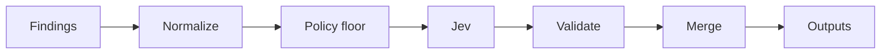

# JEV Security Sentinel

[](https://github.com/JevForge/jev-security-sentinel/releases)
[](LICENSE)
[](https://github.com/JevForge/jev-security-sentinel/actions/workflows/ci.yml)

**Turn SAST, SCA, IaC, secrets, and container findings into a CI gate** using [TypeSafe Jev](https://vercel.com/ai-gateway/models/jev) as a typed decision layer.

Scanner tools produce long lists. Teams need a clear merge gate without burying findings. This Action normalizes reports, asks Jev for `PASS` / `WARN` / `BLOCK` / `REVIEW`, then applies a deterministic policy that **keeps every finding visible** and can only make the decision stricter.

```yaml
- id: sentinel
  uses: JevForge/jev-security-sentinel@v0.1.1
  env:
    AI_GATEWAY_API_KEY: ${{ secrets.AI_GATEWAY_API_KEY }}
  with:
    sarif_path: reports/results.sarif
    environment: production
    gate_scope: changed
```

Pin `@v0.1.1`, the floating major `@v0`, or a commit SHA.

## Features

* Contextual gate for SAST, SCA, IaC, secrets, containers, and license findings
* Typed Jev evaluation (`experimental_evaluate`) — not free-form text generation
* Deterministic policy floor: Jev may escalate, never hide or weaken the floor
* Every finding stays in outputs (allowlist changes gate effect only)
* Native parsers for SARIF, Semgrep, Trivy, Snyk, Veracode, plus optional GitHub Advanced Security / remote APIs
* Structured outputs for later steps (`decision`, `risk_summary`, `findings`, …)
* Secret-based auth; credentials never go through Action inputs
* Configurable failure modes: `fail` | `warn` | `request-review` | `no-op`

## How it works

```text
Scanner reports / optional APIs
        ↓
Normalize + redact secrets
        ↓
Compute deterministic policy floor
        ↓
Jev proposes PASS | WARN | BLOCK | REVIEW
        ↓
Schema check + merge (stricter of floor and Jev)
        ↓
Action outputs (+ optional comment / annotations)
        ↓
Next CI/CD step
```



1. Load findings from JSON/SARIF paths and optional remote fetches.
2. Annotate allowlists, change scope, severity, and exploitability.
3. Compute a deterministic floor from the configured policy.
4. Call Jev through `jev_provider` (no silent provider fallback).
5. Reject invalid Jev payloads; merge so the final decision is never weaker than the floor.
6. Emit outputs. Explanation text is display-only and never executed.

## Demo

```text
Pull Request with Semgrep + Trivy reports
        ↓
Critical SQL injection on a changed path
        ↓
Policy floor = BLOCK
Jev proposed = PASS (ignored as weaker)
        ↓
decision = BLOCK
findings still include the SQL injection
        ↓
Job fails — deploy step does not run
```

## Why Jev?

Jev is the **contextual judgment** layer. Severity thresholds alone cannot weigh exploitability, production exposure, and change scope together. This Action sends a redacted sample and counts to Jev, receives a typed choice (`PASS` / `WARN` / `BLOCK` / `REVIEW`), then lets local policy enforce a floor.

Jev does **not** delete findings, invent shell commands, or replace scanners. If Jev is unavailable or below `min_confidence`, the result is marked `provisional` and `low_confidence_policy` applies — the Action never pretends a confident AI decision happened.

## Quick Start

1. Produce at least one scanner report in the workspace (for example SARIF).
2. Add repository secret `AI_GATEWAY_API_KEY` (default Jev provider).
3. Add a workflow:

```yaml
name: Security gate
on:
  pull_request:

permissions:
  contents: read
  pull-requests: read

jobs:
  sentinel:
    runs-on: ubuntu-latest
    steps:
      - uses: actions/checkout@v4

      - id: sentinel
        uses: JevForge/jev-security-sentinel@v0.1.1
        env:
          AI_GATEWAY_API_KEY: ${{ secrets.AI_GATEWAY_API_KEY }}
        with:
          sarif_path: reports/results.sarif
          environment: production
          gate_scope: changed

      - name: Print decision
        if: always()
        run: |
          echo "decision=${{ steps.sentinel.outputs.decision }}"
          echo "floor=${{ steps.sentinel.outputs.policy_floor }}"
          echo "blocking=${{ steps.sentinel.outputs.blocking_count }}"
```

## Complete Example

Use the gate decision to stop a later job:

```yaml
name: Security gate and deploy
on:
  pull_request:

permissions:
  contents: read
  pull-requests: write

jobs:
  gate:
    runs-on: ubuntu-latest
    outputs:
      decision: ${{ steps.sentinel.outputs.decision }}
    steps:
      - uses: actions/checkout@v4

      - id: sentinel
        uses: JevForge/jev-security-sentinel@v0.1.1
        env:
          AI_GATEWAY_API_KEY: ${{ secrets.AI_GATEWAY_API_KEY }}
        with:
          sarif_path: reports/semgrep.sarif
          trivy_path: reports/trivy.json
          environment: production
          gate_scope: changed
          comment_on_github: 'true'
          review_mode: fail

  deploy-preview:
    needs: gate
    if: needs.gate.outputs.decision == 'PASS' || needs.gate.outputs.decision == 'WARN'
    runs-on: ubuntu-latest
    steps:
      - run: echo "Safe to continue preview deploy"
```

More workflows: [`examples/gate.yml`](examples/gate.yml), [`examples/pr-gate.yml`](examples/pr-gate.yml), [`examples/multi-scanner.yml`](examples/multi-scanner.yml).

## Inputs

| Input | Required | Default | Description |
| --- | --- | --- | --- |
| `findings` | no | — | Inline normalized findings JSON |
| `findings_path` | no | — | Workspace path to normalized findings JSON |
| `sarif_path` | no | — | SARIF 2.1.0 report path |
| `semgrep_path` | no | — | Semgrep JSON path |
| `trivy_path` | no | — | Trivy JSON path |
| `snyk_path` | no | — | Snyk CLI or REST JSON path |
| `veracode_path` | no | — | Veracode findings JSON path |
| `fetch_ghas` | no | `false` | Fetch open code scanning, secret scanning, and Dependabot alerts |
| `fetch_snyk` | no | `false` | Fetch Snyk REST issues (`SNYK_TOKEN` + `snyk_org_id`) |
| `snyk_org_id` | no | — | Snyk organization id |
| `snyk_api_base` | no | — | Optional Snyk API origin (for example `https://api.eu.snyk.io`) |
| `fetch_veracode` | no | `false` | Fetch Veracode findings |
| `veracode_app_guid` | no | — | Veracode application GUID |
| `fetch_semgrep` | no | `false` | Fetch Semgrep App findings |
| `semgrep_deployment_id` | no | — | Semgrep deployment id or slug |
| `environment` | no | `production` | `production` \| `staging` \| `development` \| `test` \| `unknown` |
| `component` | no | — | Component name sent in Jev context |
| `gate_scope` | no | `changed` on PR, else `all` | `all` \| `changed` |
| `gate_mode` | no | `all` | `all` \| `new_only` (baseline comparison) |
| `baseline_path` | no | — | Baseline fingerprints JSON (required for `new_only`) |
| `changed_paths` | no | PR files via API | JSON array of paths |
| `min_confidence` | no | `0.75` | Minimum Jev confidence to trust the proposal |
| `low_confidence_policy` | no | `fail` | `fail` \| `warn` \| `request-review` \| `no-op` |
| `source_error_policy` | no | `fail` | `fail` \| `warn` when a source cannot be read |
| `review_mode` | no | `fail` | `fail` \| `continue` for `REVIEW` (`BLOCK` always fails) |
| `jev_provider` | no | `vercel-ai-gateway` | `vercel-ai-gateway` \| `typesafe-native` \| `custom-compatible` |
| `jev_endpoint` | no | — | HTTPS evaluate endpoint (`custom-compatible`) |
| `jev_model` | no | — | Catalog model id (native / custom). Gateway default: `typesafe-ai/jev` |
| `timeout_ms` | no | `45000` | Remote call timeout |
| `max_findings` | no | `2000` | Max preserved findings (overflow → at least `REVIEW`) |
| `max_findings_to_jev` | no | `40` | Sample size sent to Jev (policy still sees all) |
| `comment_on_github` | no | `false` | Post a PR/issue summary comment |
| `annotate` | no | `true` | Emit workflow annotations for in-scope findings |
| `dry_run` | no | `false` | Skip comments and annotations |
| `github_token` | no | `${{ github.token }}` | Token for PR files, comments, optional GHAS |

Paths must stay inside `GITHUB_WORKSPACE`. Reports larger than 20MB are rejected as source errors. Scanner credentials belong in `env`, not in `with:`.

## Outputs

| Output | Description |
| --- | --- |
| `decision` | Final `PASS` \| `WARN` \| `BLOCK` \| `REVIEW` |
| `confidence` | `0`–`1` (or `0` when Jev did not evaluate) |
| `reason_codes` | JSON array of stable reason codes |
| `findings` | JSON array of every preserved finding (empty when spilled) |
| `findings_file` | Workspace file path when findings were spilled |
| `findings_count` | Number of preserved findings |
| `findings_spilled` | `true` when findings were written to `findings_file` |
| `risk_summary` | JSON counts (includes allowlisted / out-of-scope) |
| `provisional` | `true` when the result is not a confident Jev evaluation |
| `jev_status` | `evaluated` \| `unavailable` \| `schema_rejected` |
| `jev_proposed` | Jev choice, or empty when Jev did not evaluate |
| `policy_floor` | Deterministic minimum decision |
| `policy_id` | Policy identifier |
| `blocking_count` | Findings with `gate_effect: blocking` |
| `summary` | One-line decision summary |

### Using outputs in conditions

```yaml
- name: Continue only when the gate is clear
  if: steps.sentinel.outputs.decision == 'PASS'

- name: Soft-allow warnings
  if: contains(fromJSON('["PASS","WARN"]'), steps.sentinel.outputs.decision)

- name: Require humans when REVIEW
  if: steps.sentinel.outputs.decision == 'REVIEW'
  run: echo "Needs security review"
```

`BLOCK` fails the step by default. Use `if: always()` on follow-up steps that must still print outputs after a failed gate.

## Authentication

Create secrets under **Settings → Secrets and variables → Actions → New repository secret**.

| Secret | When |
| --- | --- |
| `AI_GATEWAY_API_KEY` | Default `jev_provider: vercel-ai-gateway` |
| `TYPESAFE_API_KEY` | `jev_provider: typesafe-native` |
| `JEV_CUSTOM_API_KEY` | `jev_provider: custom-compatible` |
| `SNYK_TOKEN` | `fetch_snyk: true` |
| `VERACODE_API_ID` / `VERACODE_API_KEY` | `fetch_veracode: true` |
| `SEMGREP_APP_TOKEN` | `fetch_semgrep: true` |

```yaml
env:
  AI_GATEWAY_API_KEY: ${{ secrets.AI_GATEWAY_API_KEY }}
```

Do not put API keys in `with:`. Providers never fall back to each other.

## Permissions

Minimum for local reports + PR file scope:

```yaml
permissions:
  contents: read
  pull-requests: read
```

| Extra permission | When |
| --- | --- |
| `pull-requests: write` | `comment_on_github: true` |
| `security-events: read` | `fetch_ghas: true` |

## Decision model

Default **production** floor:

* `critical` / `high` → block
* `unknown` → review
* `medium` → warn
* secrets in scope → block (even at low scanner severity)
* known-exploited at medium+ → block
* proof-of-concept at high → block; at medium → review

On pull requests, `gate_scope: changed` marks findings outside the diff as `out_of_scope` (still listed). If changed paths cannot be loaded, findings are treated as in scope.

Use `gate_mode: new_only` with `baseline_path` to raise the floor only for findings whose fingerprint is absent from the baseline. Baseline matches stay visible as `gate_effect: baseline`.

| `low_confidence_policy` | Behavior |
| --- | --- |
| `fail` | At least `REVIEW`, job fails (blocking floor still blocks) |
| `warn` | At least `WARN` |
| `request-review` | At least `REVIEW` |
| `no-op` | Deterministic floor only (explicitly not a Jev decision) |

Contract examples: [docs/decision-contract.md](docs/decision-contract.md).

## Data sent to Jev

* Environment, component, gate scope, policy floor, severity counts
* Up to `max_findings_to_jev` prioritized records (id, category, severity, exploitability, rule, path, CVE, title)

Secret findings send the rule id only. Messages are redacted. Findings beyond the sample still affect the local policy floor. Gateway requests use zero data retention. Custom endpoints must be HTTPS.

## Configuration

Optional `.jev/config.yml` supplies provider and policy defaults. Workflow inputs win when set. See [`examples/.jev/config.yml`](examples/.jev/config.yml).

Allowlist (`rule_ids`, `cves`, `fingerprints`, `paths`, `ids`) sets `gate_effect: allowlisted`. `exclude_paths` sets `out_of_scope`. Both remain in `findings`.

## Troubleshooting

| Signal | Meaning |
| --- | --- |
| `JEV_UNAVAILABLE` + `provisional: true` | Missing credential, timeout, or HTTP error for the selected provider |
| `SCHEMA_REJECTED` | Jev returned an invalid choice; floor is used |
| `SOURCE_UNAVAILABLE` | Missing report, path escaped workspace, or scanner API failed |
| `CHANGED_PATHS_UNKNOWN` | PR file list unavailable; findings treated as in scope |
| `FINDINGS_TRUNCATED` | More than `max_findings`; gate is at least `REVIEW` |

## Security

* Secrets and raw secret matches are redacted before Jev and logs
* Report paths are confined to the workspace
* Jev explanation text is never executed as a command, path, or GitHub operation
* Allowed side effects: set outputs, fail/warn the step, annotate files, optional comment

See [SECURITY.md](SECURITY.md).

## Versioning

```yaml
uses: JevForge/jev-security-sentinel@v0      # floating major
uses: JevForge/jev-security-sentinel@v0.1.1 # exact release
```

Prefer an exact tag or commit SHA for production workflows.

## Development

```bash
npm ci
npm test
npm run typecheck
npm run build
```

Node.js 24+. Consumers run `dist/index.js` and do not need `npm install`. Rebuild and commit `dist/` when the entrypoint changes.

## Contributing

See [CONTRIBUTING.md](CONTRIBUTING.md). Bug and feature templates live under `.github/ISSUE_TEMPLATE/`.

## License

MIT — [LICENSE](LICENSE).
